# AI Agent – ReportMaker

This project is a simple **AI Research Agent** that takes a user query, finds useful sources online, extracts their content, summarizes them using an LLM, and stores the reports in a database with a web interface for viewing past results.

---

## 🚀 Features
- Accepts a **user query** from a web form.
- Uses **SerpAPI** to fetch 2–3 relevant sources.
- Extracts clean text from **HTML (trafilatura)** and **PDFs (pypdf)**.
- Summarizes sources using the **OpenAI API**.
- Saves query, summary, and sources in a **SQLite database**.
- Displays reports in a **Flask web interface** (history + detailed view).
- Graceful error handling (e.g., search failure, blocked pages, empty extraction).

---

## 🏗️ Architecture

```mermaid
flowchart TD
    A[User Query] --> B[SerpAPI Search]
    B --> C[2–3 URLs]
    C --> D[Content Extractor: trafilatura + pypdf]
    D --> E[LLM Summarizer: OpenAI]
    E --> F[SQLite Database]
    F --> G[Web UI: Flask]

```



- **SerpAPI** → finds relevant sources.
- **Extractor** → downloads & cleans up content.
- **OpenAI Summarizer** → produces a structured report.
- **SQLite** → stores queries & reports for later.
- **Flask** → serves a history page and individual reports.

---

## 📂 Project Structure
```
ai-agent/
├── app.py             # Flask app and routes
├── searcher.py        # SerpAPI integration
├── extractor.py       # Content extraction logic
├── summarizer.py      # OpenAI summarizer
├── models.py          # Database models (if separated)
├── templates/
│   ├── index.html     # Home (search + history)
│   └── report.html    # Report view
├── requirements.txt   # Python dependencies
└── README.md
```

---

## ⚙️ Setup & Run

### 1. Clone Repo & Setup Virtual Environment
```bash
git clone https://github.com/YOUR_USERNAME/ai-agent.git
cd ai-agent
python -m venv .venv
source .venv/bin/activate   # On Windows: .venv\Scripts\activate
```

### 2. Install Dependencies
```bash
pip install -r requirements.txt
```

### 3. Add Environment Variables  
Create a `.env` file in the root directory:

```ini
FLASK_ENV=development
FLASK_SECRET=supersecretkey
DATABASE_URL=sqlite:///reports.db

SERPAPI_API_KEY=your_serpapi_key
OPENAI_API_KEY=your_openai_key
OPENAI_MODEL=gpt-4o-mini
```

### 4. Run the App
```bash
python app.py
```
Visit 👉 [http://127.0.0.1:5000](http://127.0.0.1:5000)

---

## 📝 Example Run

**Query:**  
`H-1B Visa`

**Example Report Screenshot:**  


**Example History and Query Screenshot:**  


---

## 🤖 AI Assistance

- AI was used for **designing the front-end web pages**.
- Final debugging, integration, and testing were done manually.

---


